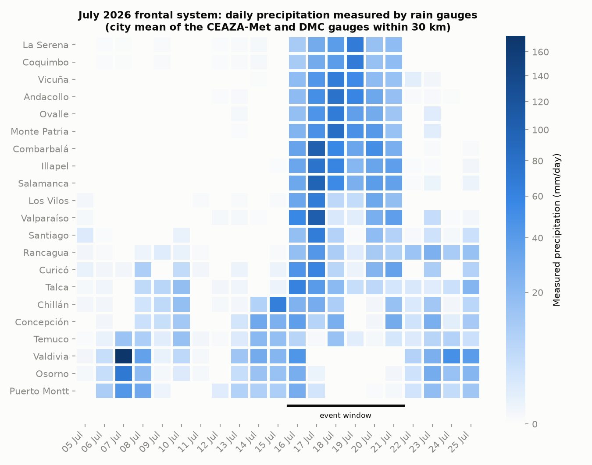
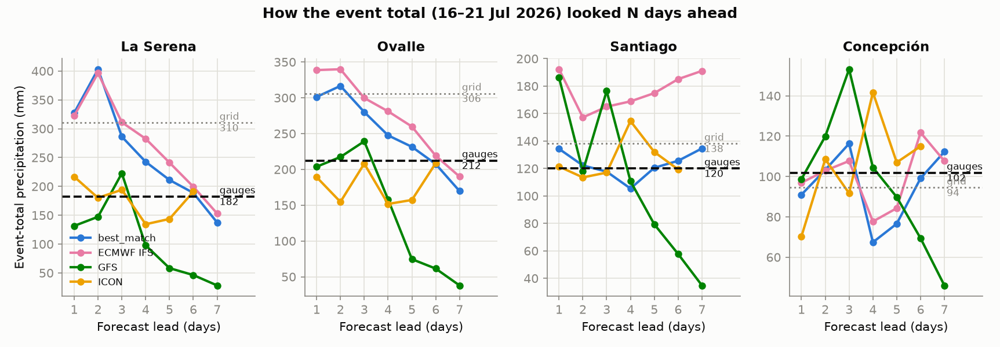
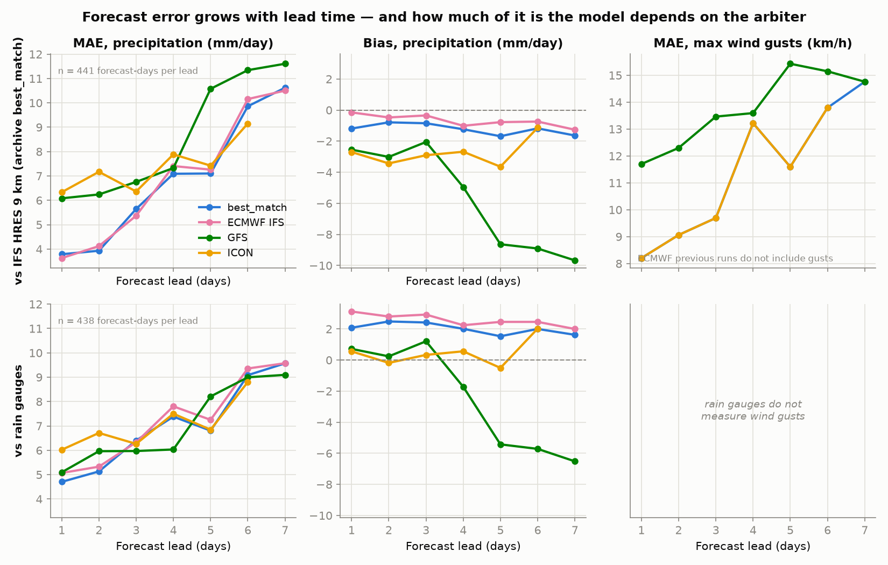
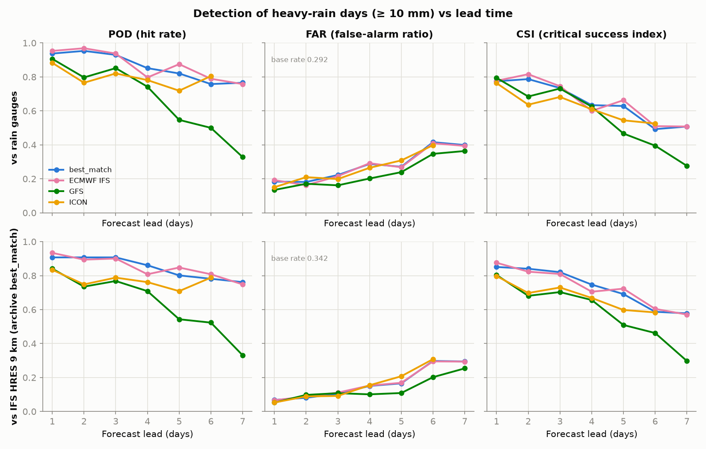
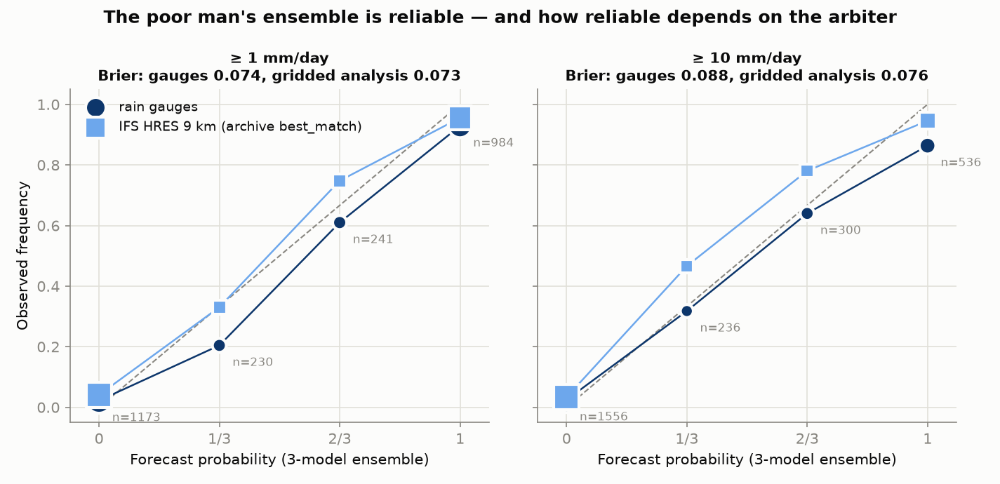
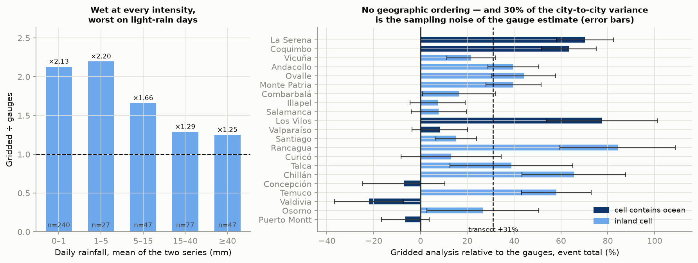
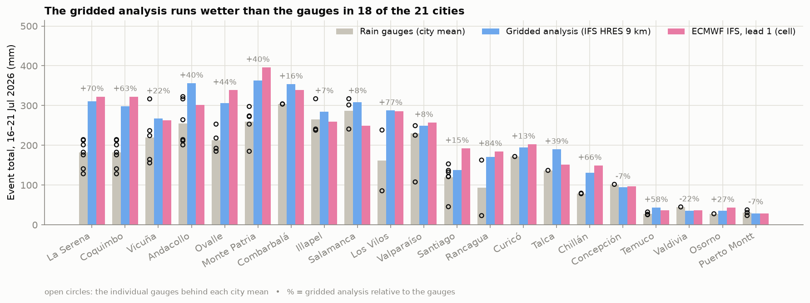
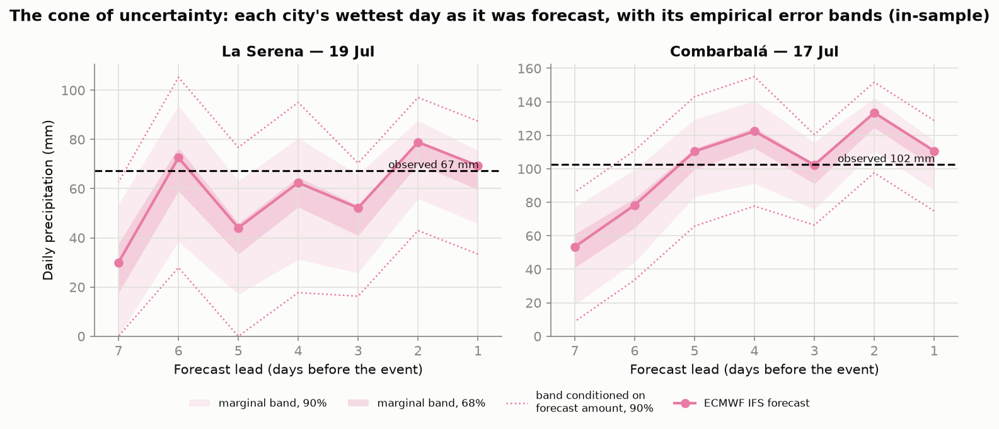
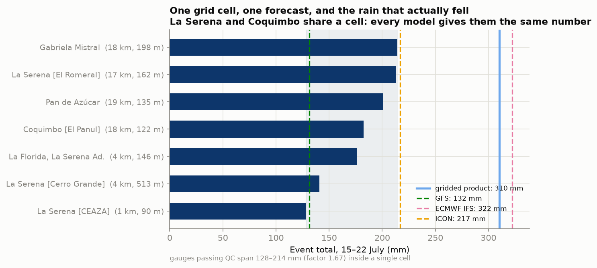

# How good were the forecasts? Verifying the July 2026 Chile frontal system

In mid-July 2026 a deep frontal system swept central and northern Chile. Over six days, rain gauges in the semi-arid Coquimbo Region measured **304 mm in Combarbalá**, 287 mm in Salamanca and 255 mm in Andacollo, which is roughly a year's rain for several of those towns. At La Serena it was the wettest July on record since 1954. The forecasts had been talking about it for days. But how far ahead did the models actually know, and how much should anyone have trusted them at each point?

This repo is a compact, reproducible **forecast verification** study. It compares what four operational models (ECMWF IFS, GFS, ICON and Open-Meteo's `best_match` blend) predicted 1–7 days ahead against what **69 rain gauges** from the CEAZA-Met and DMC networks measured, across 21 cities on a 1,300 km transect from La Serena to Puerto Montt. The tools are the standard ones: error growth by lead time, categorical skill scores, Brier scores with their Murphy decomposition, reliability diagrams and CRPS.

It also spends real effort on something verification studies usually take for granted: what counts as "observed". Every score here is computed three times over, against the rain gauges, against a gridded analysis at 9 km, and against ERA5 at 0.25°, and every conclusion carries a computed verdict on whether it survives the change of judge. There is a specific reason to worry about this. The gridded series most studies would reach for in this region is **ECMWF's own operational analysis**, so verifying ECMWF against it comes close to circular.

**The short version:** weather models are not crystal balls, but their uncertainty is measurable. Skill degrades smoothly with lead time, the models disagree in informative ways, and even a crude 3-model "poor man's ensemble" produces probabilities you can act on. The surprise is which findings survive a change of arbiter and which do not. The shape of the error growth is robust. The **ranking of the models is not**.

## The event



The event window, **16–21 July 2026**, comes out of the data rather than out of a decision: it is the contiguous run of days on which a majority of the 21 cities recorded measurable rain at their gauges, and it contains the wettest day. A separate southern episode around 7–8 July (173.9 mm in one day at Valdivia's gauges) falls outside it.

The front concentrated, unusually, on the semi-arid north. Seven interior localities in the Coquimbo Region measured more than 200 mm in six days, inverting the country's usual north–south rainfall gradient. That inversion is what made the event exceptional, and it is why the forecasting question mattered to the people living there.

## Results at a glance

**1. Two of the three models got the event total right, and the celebrated one did not.** Summed over all 21 cities and all six days, the gauges measured **3,392 mm**. One day ahead, ICON had forecast 3,575 mm (+5%) and GFS 3,638 mm (+7%). ECMWF forecast **4,457 mm, or +31%**. The gridded analysis gives 4,445 mm: it agrees with ECMWF's forecast to within 0.3% and misses the instruments by just as much as that forecast does. Two products of the same physical system agreeing with each other, and disagreeing with the measurement, is not evidence of skill. Where the event was most extreme the gap widens. Across the ten Coquimbo cities, ICON's mean event-total error was −1 mm, GFS's −15 mm, and ECMWF's **+75 mm**.



**2. Error grows with lead time, smoothly, and that is the robust part.** Daily-precipitation MAE against gauges roughly doubles across the week, from ~4.7–6.0 mm at 1 day to ~8.8–9.6 mm at 7 days, with no cliffs. Against the gridded analysis, ECMWF's day-1 MAE (3.63 mm) is 1.7× better than GFS's (6.08). Against gauges they are tied (5.07 vs 5.10), and GFS is *ahead* at leads 3, 4, 6 and 7. Every model's bias flips sign with the arbiter: ECMWF goes from −0.15 mm/day against the grid to **+3.12 against gauges**, and the shift is the same +3.27 mm/day for all four models at all leads, which is what a property of the *observation* looks like rather than a property of any model. One bias feature does survive the switch: GFS's dry collapse at long leads (−5.4 to −6.5 mm/day at leads 5–7). That one belongs to the model.



**3. Heavy-rain detection decays gradually, not suddenly.** For "will we get ≥ 10 mm today?" (base rate 0.292 at the gauges), day-1 hit rates run 0.88–0.95 with false-alarm ratios of 0.13–0.19. By day 7, ECMWF and `best_match` still detect ~76% of events; GFS falls to 0.33. Skill fades over the week rather than switching off, so even a six-day forecast carries real information.



**4. A poor man's ensemble gives usable probabilities.** Treating GFS + ECMWF + ICON as three equally likely scenarios yields exceedance probabilities in {0, ⅓, ⅔, 1}. When 2 of 3 models said "≥ 10 mm", it rained ≥ 10 mm **64%** of the time; when all three agreed, **86%**; when none did, 2.4%. Read against the gridded analysis the same forecasts give 78% and 95%. The ordering survives the change of judge, the calibration does not, and against instruments the ensemble turns out to over-forecast. The Murphy decomposition shows where the skill comes from: reliability 0.004, resolution 0.123, uncertainty 0.207. Calibration error is 5% of the score, and what remains is real skill at separating wet days from dry ones. Brier skill score against climatology falls from 0.735 (1 day) to 0.328 (6 days), and ensemble CRPS grows from 3.45 to 6.02 mm, beating the average single member (5.40 → 9.05 mm) at every lead without anyone having to know in advance which member would win.



**5. The gridded analysis runs 30% wetter than the gauges, uniformly rather than geographically.** Over 438 city-days it gives 14.01 mm/day against the instruments' 10.75 (+3.27 mm/day), while tracking the day-to-day evolution extremely well (pooled daily *r* = 0.91; 0.95 on the square-root scale). True ERA5 behaves the same way (+33%), so the choice *between* gridded products is not the issue: the two are statistically interchangeable in 106 of 108 comparisons.

The excess is roughly multiplicative and present at every intensity (×1.25 on days above 40 mm, ×2.1 on light-rain days), and it splits into two halves of similar size: the grid has **10% more wet days** and rains **19% harder** on the days it rains. What it does *not* have is geographic structure. The median excess is +8% in the seven cities whose cell contains ocean and +33% in the fourteen inland ones; no candidate variable (latitude, gauge elevation, cell elevation, gauge distance, event size) correlates with it above ρ = 0.37; and **30% of the city-to-city variance is sampling noise** in the gauge estimate itself. A city's rainfall here is the mean of a handful of points inside an 80 km² cell, and the typical within-cell gauge CV is 0.19. What is left after that, ±22%, is about the size of the variation *inside* a single cell.



Recomputing the headline scores with gauges as truth, over exactly the same city-days:

| metric | robust | shifted | fragile | sign flips |
|---|---|---|---|---|
| bias | 0 | 27 | 0 | **21** |
| FAR | 1 | 23 | 3 | 0 |
| MAE | **21** | 6 | 0 | 0 |
| POD | **19** | 8 | 0 | 0 |

(27 model × lead cells; verdicts from a date-block bootstrap in `scripts/robustness.py`.) Error magnitude and detection are properties of the forecast. Bias and false-alarm ratio are, largely, properties of the arbiter.



**6. What does "80 mm" mean, plus or minus what?** Empirical error quantiles turn each forecast into an interval, but the pooled band is the wrong one to quote. Stratifying shows why: it contains 99.8% of cases when the forecast is 0 mm and only **27.8%** (at the 68% level) when the forecast is ≥ 10 mm. Conditioned on a heavy forecast, an **ECMWF forecast of 80 mm at 1–3 days honestly means "44 to 98 mm" with 90% confidence**, asymmetric downward because ECMWF over-forecasts against instruments. At 4–7 days the same forecast means "35 to 113 mm". The error distribution is also markedly non-Gaussian: ±1·MAE covers 65–74% of cases where a normal would give 57.5%, while ±2·MAE covers only 80–84% against the normal's 88.9%.



**7. One grid cell, one forecast, seven different rainfalls.** La Serena and Coquimbo are 12 km apart and fall in the same grid cell of all three physical models, which therefore issue them **bit-identical forecasts**: maximum difference 0.000000 mm over every date × lead combination in the capture, asserted in code rather than claimed in prose. The seven gauges inside that cell measured between **128.4 and 214.4 mm** during the event, a factor of 1.67. That spread is the irreducible floor of this exercise, and no amount of better physics at this resolution gets under it. The cell also shows the arbiter problem in miniature. Against the gridded value (310 mm), ECMWF (323 mm) looks near-perfect and GFS (132 mm) looks broken; against the gauge mean (180 mm) the ranking reverses.



**8. The gridded analysis mistimed the peak in that same cell by two days.** Comparing each city's daily gridded series against its gauges at lags of −2 to +2 days, 19 of 21 cities correlate best at lag zero. The two exceptions are La Serena and Coquimbo, the same cell, where the analysis puts its maximum on 17 July (102.8 mm) and all seven instruments put theirs on the 19th (67.3 mm mean). Four CEAZA-Met gauges and three DMC gauges, on different clocks and different protocols, agree with each other and disagree with the grid.

> **The bands in result 6 are in-sample:** they are fitted and evaluated on the same event, so their pooled coverage is nominal by construction and is not evidence of calibration. What is informative is their *width*, their asymmetry, and where they fail. Out-of-sample calibration needs a multi-year backtest (see [What's next](#whats-next)).

## Why your app shows two different numbers for the same grid cell

Result 7 says the three physical models give La Serena and Coquimbo the same forecast, down to the last decimal. Yet anyone who opens Windy, or CEAZA's alert system, sees two different numbers for the two cities. Where do they come from? There are three mechanisms, and only the third one adds information.

**1. Interpolation.** The most common, and the one most people assume is physics. A global model produces values at the nodes of a grid, so giving a forecast for an arbitrary point requires interpolating between them. ECMWF documents bilinear interpolation over the four nearest nodes, weighted by distance, as its standard for point products. Two points inside "the same cell" therefore receive two different weighted averages *of the same four numbers*: a difference that is real as a number and empty as information. Open-Meteo instead serves the value of the nearest node for the physical models, which is why La Serena and Coquimbo come out bit-identical here.

This dataset happens to contain the clean demonstration of both halves. Over the same 147 date × lead combinations, ECMWF and GFS differ between the two cities by 0.000000 mm, while `best_match`, which does interpolate and blend across its own grid, differs by up to **29.6 mm**. Those 29.6 mm are not extra knowledge about Coquimbo. They are the interpolation weight.

**2. Statistical post-processing and elevation correction.** Many services correct raw model output against each station's own history (MOS, model output statistics), or against the gap between the model's orography and the point's real elevation. When they do, the two cities differ because their *histories or their altitudes* differ, not because the model resolves them. That is information, but it is observational information about the past, injected on top of a forecast that is still the same forecast.

**3. A higher-resolution model.** This one genuinely adds physics. A limited-area model nested inside a global one, typically WRF at a few kilometres, has its own topography, its own coastline and its own boundary layer, and at 2–4 km La Serena and Coquimbo land in different cells. CEAZA runs exactly that setup for the Coquimbo Region, combining WRF over the region with output from the global models and with its own station network, which is dense in precisely this cell. Its per-locality forecast is not an interpolation.

Two caveats, both of which this study can quantify. Higher resolution buys **detail**, not automatically **accuracy**: a 3 km model can put the rainfall maximum in the wrong valley, and finding that out requires exactly the exercise in this repo, judged against instruments rather than against its own analysis. And there is a hard ceiling underneath all of it. Result 7 measured seven gauges inside that single cell spanning a factor of 1.67; no forecast "for La Serena", at 9 km or at 3, can be right for all seven at once, because the seven did not measure the same thing. Below that scale, "how much will it rain in La Serena?" stops having one answer.

The practical version, for reading an app: **two neighbouring towns showing different numbers does not mean the model tells them apart.** If the numbers come from the same global model, the difference is most likely the interpolator.

A related note, since it came up constantly during the event: **Windy is not a forecast model.** It is a visualization platform that displays these same operational models, with ECMWF IFS as its default layer and GFS, ICON and others a menu away. The maps that circulated on social media and television during this storm were, almost certainly, the ECMWF forecasts this study verifies.

## Sanity check against published figures

The gauge series behind all of the above is reconstructed from the DMC's cumulative 6-hour counters (see [Method](#method)), which is exactly the kind of processing that deserves a check against numbers this project did not produce. `data/external/media_reported_totals.csv` holds twelve totals published by Chilean media from DMC and DGAC balances, each with its station, its accumulation window and its URL; `scripts/press_check.py` sums our series over the same window each source used.

On the **five rows whose window our series covers completely, the median difference is −2.1% and the worst is 5.5%** (La Florida 59.0 vs 59.8 mm; Rodelillo 177.4 vs 173.6; Quinta Normal 95.9 vs 101.5). On the seven monthly totals our series runs short by a median 9.7%, all in the same direction, for an identifiable reason that is ours: 31 July was captured with 20 of 24 hours, below the 90% completeness bar, so QC drops it at every station rather than summing a partial day. A month missing a rainy day sums short. The scores in this study are computed on complete days only.

## Data

Everything comes from free, public APIs and is snapshotted raw (JSON, with capture metadata) in `data/raw/<capture-date>/`, so the analysis runs from immutable inputs.

| Source | API | Content |
|---|---|---|
| Archived forecasts | [Previous Runs API](https://open-meteo.com/en/docs/previous-runs-api) | Hourly precipitation and wind gusts as forecast 1–7 days ahead, per model |
| Gauges (north) | [CEAZA-Met web service](http://www.ceazamet.cl/ws/) | Daily totals, Coquimbo Region, public, no registration |
| Gauges (nationwide) | [DMC climate services](https://climatologia.meteochile.gob.cl/) | 15-minute series, 36 automatic stations, free token required |
| Gridded analysis | [Historical Weather API](https://open-meteo.com/en/docs/historical-weather-api) | `models=best_match` — IFS HRES 9 km for this period, **not** ERA5 |
| Reanalysis | same API | `models=era5` — true ERA5 at 0.25°, captured separately |

Models: `ecmwf_ifs025`, `gfs_seamless` (NOAA), `icon_seamless` (DWD), `best_match` (Open-Meteo's blend, excluded from the ensemble because it is not independent).

Cities: La Serena, **Coquimbo**, Vicuña, Andacollo, Ovalle, Monte Patria, Combarbalá, Illapel, Salamanca, Los Vilos (Coquimbo Region sub-transect), Valparaíso, Santiago, Rancagua, Curicó, Talca, Chillán, Concepción, Temuco, Valdivia, Osorno, Puerto Montt. Coquimbo is kept on purpose even though no model distinguishes it from La Serena; that is the point of result 7.

The final analysis uses the 2026-07-26 capture: 11,907 rows, valid dates 5–25 July 2026, **441 cases per model × lead** (21 cities × 21 days) against the gridded arbiters and 438 against gauges.

Known limitations:

- The **gridded observations are a model analysis, not rain gauges**, and they are produced by the same centre as one of the verified models. Result 5 quantifies what that costs instead of just asserting it.
- **Gauge density is very uneven.** All 21 cities have an estimate, but five rest on a single instrument (Concepción, Curicó, Osorno, Talca, Valdivia), and in two (Los Vilos, Rancagua) the only two gauges disagree with no third opinion to break the tie. Those keep their estimate flagged rather than being silently dropped or silently trusted. A gauge is not perfect truth either: it under-catches in wind, which in a storm is exactly when it matters.
- **One event, wet sample.** Base rates (0.29–0.47) are far above July climatology, which inflates categorical scores relative to a long-run evaluation. The absolute numbers here do not generalise.
- ECMWF previous runs do not include wind gusts; ICON previous runs stop at 6 days of lead. All-null lead-7 series are dropped, never coerced to 0 mm.
- **`aguaCaidaDelMinuto` from the DMC API is a trap**: it is one minute of rain sampled every fifteen, so summing it over July gives 10.6 mm for a month that recorded 155. The pipeline rebuilds daily totals by differencing the 6-hour running counter instead, detecting per station whether the boundary reading closes or resets the block.

## Method

1. **Capture** (`scripts/capture_forecasts.py`): pulls archived forecasts (leads 1–7, 4 models) and both gridded observation series for the 21 cities into `data/raw/<capture-date>/`, one JSON per city × source × model, with `models=` always stated explicitly. `--cities` and `--into <capture> --skip-existing` extend an existing snapshot without overwriting a byte of it.
2. **Tidy** (`scripts/build_dataset.py`): aggregates hourly values to daily totals (precipitation) and maxima (gusts) in local time, then joins forecasts with observations into one long table of city × valid date × model × lead. Daily aggregates require all 24 hours present.
3. **Gauges** (`scripts/fetch_stations.py`, `scripts/fetch_stations_dmc.py`): harvests every CEAZA-Met and DMC gauge within 30 km of each city (raw responses plus a fetch manifest recording every request and timestamp), under one shared matching and QC policy in `scripts/stations_common.py`. A city's rainfall is the **mean** of its QC-passing gauges, with the spread carried alongside. A gauge is excluded only if it differs from the median of **at least two** peers by more than a factor of 2, because with a single peer two gauges accuse each other symmetrically and nothing in the data says which one is wrong. `stations_common.event_window()` derives the event window from the gauges and asserts it.
4. **Verify** (`scripts/verify.py`): MAE / bias / RMSE by model × lead; POD / FAR / CSI at 1, 10 and 20 mm/day; Brier score, skill score and reliability for the 3-model ensemble; ensemble CRPS. Every table is computed **once per arbiter** and stacked with a `truth` column. Figures 1–5.
5. **Station comparison** (`scripts/station_validation.py`): event totals and daily series, gauges vs gridded vs forecast, always on the days the gauges actually reported. Figures 6–7.
6. **Bias structure** (`scripts/bias_structure.py`): what shape the wet bias has. Intensity bins (built on the *symmetric* average of the two series, so the binning does not select on either one's noise), the wet-day frequency/intensity split, the geographic test, the sampling-noise floor, and the per-city lag scan. Figure 10.
7. **Bands** (`scripts/coverage_analysis.py`): empirical error quantiles by model × lead and conditioned on the forecast amount, coverage of ±k·MAE and of the quantile bands within strata that did not define them (all with Wilson intervals), the ensemble rank histogram and the spread–error relationship. Figure 8.
8. **Robustness** (`scripts/robustness.py`): for each metric × model × lead, measures the gap between two arbiters against the bootstrap standard error of that gap (resampling *dates*, since a front hits twenty cities on the same day), then labels it robust, shifted or fragile. That is what turns "the conclusion survives" from an opinion into a column.
9. **Sub-grid case** (`scripts/subgrid_case.py`): asserts that the physical models give La Serena and Coquimbo identical forecasts, and quantifies the gauge spread inside that one cell. Figure 9.
10. **Traceability** (`scripts/press_check.py`, `scripts/report_numbers.py`, `scripts/audit_numbers.py`): the first cross-checks the harvest against published DMC totals; the second recomputes into `report_numbers.json` the derived quantities that no metrics CSV holds (dataset size, event window, the Murphy terms, the worked ensemble cases); the third checks **126 load-bearing numbers** against those CSVs and that JSON, and exits non-zero on any mismatch.

## Reproduce

Requires [uv](https://docs.astral.sh/uv/) (Python 3.12 is pinned; dependencies are locked in `uv.lock`):

```bash
uv run scripts/build_dataset.py        # data/raw/ snapshots -> tidy dataset
uv run scripts/fetch_stations.py       # -> CEAZA-Met gauges + manifest
uv run scripts/fetch_stations_dmc.py   # -> DMC gauges (needs DMC_API_TOKEN)
uv run scripts/verify.py               # -> metrics CSVs (per arbiter) + fig1..fig5
uv run scripts/station_validation.py   # -> three-way comparison + fig6, fig7
uv run scripts/bias_structure.py       # -> structure of the wet bias + fig10
uv run scripts/coverage_analysis.py    # -> error bands + fig8
uv run scripts/subgrid_case.py         # -> one-cell case study + fig9
uv run scripts/robustness.py           # -> which conclusions survive the arbiter
uv run scripts/press_check.py          # -> cross-check vs published DMC totals
uv run scripts/report_numbers.py       # -> derived numbers quoted in the prose
uv run scripts/audit_numbers.py        # -> checks the prose against the CSVs
```

The DMC harvest needs a free personal token ([self-service registration](https://climatologia.meteochile.gob.cl/application/usuario/registroUsuario)) in a git-ignored `.env`:

```
DMC_API_USER=you@example.com
DMC_API_TOKEN=your_token
```

Everything else runs without credentials. `fetch_stations_dmc.py --reprocess` rebuilds the daily series from the archived raw responses without calling the service again. Re-running `scripts/capture_forecasts.py` creates a new dated snapshot under `data/raw/` without touching existing ones.

## What's next

`forecast-calibration-chile` (in preparation) takes on the open questions this study cannot answer from a single event: whether the ~30% grid-to-gauge correction is stable across seasons and events, model→gauge calibration, and honest **out-of-sample** uncertainty bands from a multi-year backtest of the Previous Runs archive.

## Verification glossary

- **Lead time**: how many days before the valid date the forecast was issued.
- **MAE / bias**: mean absolute error / mean error (signed) of daily precipitation.
- **POD / FAR / CSI**: probability of detection, false-alarm ratio and critical success index for a yes/no event ("≥ 10 mm today"), from the 2×2 contingency table.
- **Brier score / BSS**: mean squared error of a probability forecast; the skill score compares it against always forecasting the sample base rate.
- **Murphy decomposition**: the exact split of the Brier score into reliability (are the probabilities honest?), resolution (do they separate wet days from dry?) and uncertainty (how hard was the question?).
- **Reliability diagram**: observed frequency vs forecast probability. A calibrated forecast lies on the diagonal.
- **CRPS**: continuous ranked probability score, the Brier score integrated over all thresholds. That makes it the generalization of MAE to probabilistic forecasts, and puts both on the same axis in mm.
- **Coverage**: the fraction of cases in which the observation fell inside a stated interval. A band is *calibrated* when coverage matches its nominal level; fitting and evaluating on the same sample makes that match automatic, which is why the in-sample caveat matters.
- **Rank histogram**: where the observation falls among the sorted ensemble members. Flat means the ensemble spreads correctly; here it is under-dispersive, as three members must be.
- **Representativeness**: the difference between what a ~9 km grid cell can mean and what a gauge in one spot measures. It is a property of the comparison, not an error by either side, and result 7 measures it at a factor of 1.67 inside a single cell.
- **Arbiter**: whatever a study calls "observed". This one has three, says so, and reports how much each conclusion depends on the choice.

## How this was built

This study was built with [Claude Code](https://claude.com/claude-code) as the working tool, under the author's direction and review. Everything it produced is checkable from the repo: raw API responses were snapshotted before the analysis was designed, every score is computed against three arbiters in parallel, and `audit_numbers.py` regenerates every load-bearing number in this README from the CSVs and exits non-zero on any mismatch.

## License and data

The code, the figures and the analysis are MIT licensed (see [`LICENSE`](LICENSE)).

The observations and forecasts under `data/raw/` are third-party data, snapshotted here so that the analysis reproduces from immutable inputs rather than from an API whose archive rolls over. They belong to their providers, and the providers' terms govern any reuse:

- Forecasts and gridded analyses: [Open-Meteo](https://open-meteo.com/), redistributing output from ECMWF, NOAA/NCEP and DWD.
- Coquimbo Region gauges: [CEAZA-Met](http://www.ceazamet.cl/), Centro de Estudios Avanzados en Zonas Áridas.
- Nationwide gauges: [Dirección Meteorológica de Chile](https://climatologia.meteochile.gob.cl/), accessed with a free personal token.
- Published totals in `data/external/media_reported_totals.csv`: every row carries the URL and access date of the story it was taken from.

If you are one of these providers and would rather a snapshot were not mirrored here, open an issue and it comes down.
